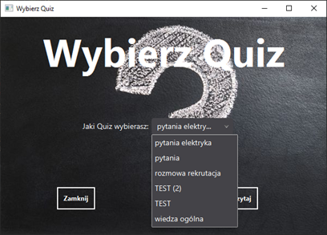
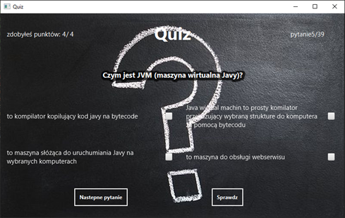
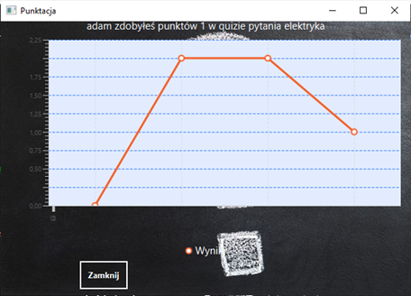

# programQuizVer3

Application can be used for learning by solving tests. User can load his own quiz saved in txt file. Application shows this questions in random order as well as answers and amount of good and bad answers. At the end there is displayed linear chart showing last 10 [nie wiem ile??] achieved results stored in database.  

**Technologies:** Java, JavaFX, MySQL, CSS, MVC, XAMPP
 
**What have I learned new?**
•	How to create more complex windows application
•	How to read data from file using Java
•	Operations with Strings
•	Passing variables between two different application windows
•	Creating simple charts from Java
•	MVC design pattern
•	Edit view using Java and CSS

**Screen Schot**

